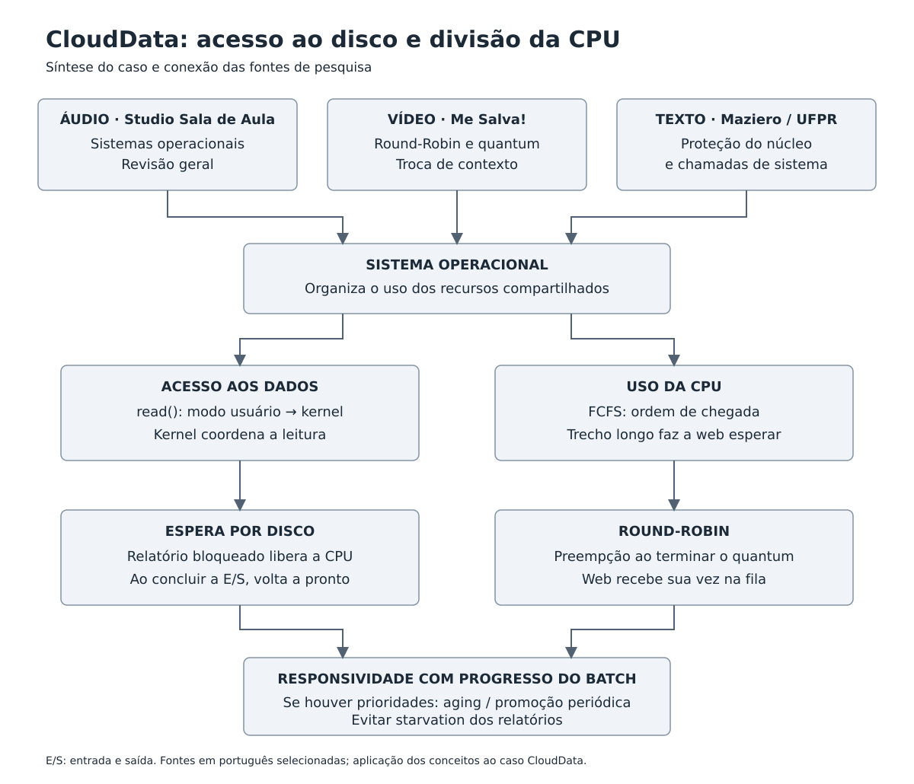

# Diário de Bordo — Encontro 6
## O dilema do servidor em nuvem

**Aluno:** Diogo de Oliveira Teixeira  
**Disciplina:** Sistemas Operacionais  
**Data:** 1 de outubro de 2026  
**Estudo de caso:** CloudData

## 1. Registro do problema

A CloudData utiliza um servidor de núcleo único para atender requisições web e gerar relatórios financeiros. Como há apenas um núcleo, os processos precisam compartilhar o tempo de CPU. O desafio é permitir que os relatórios avancem sem fazer as requisições dos usuários esperarem por longos períodos.

A análise considera o FCFS não preemptivo descrito no enunciado. Os slides da aula serviram como ponto de partida, principalmente os tópicos de bloqueio por entrada e saída, preempção, Round-Robin e prioridades (Rocha, [s.d.], slides 5–8 e 20–23).

## 2. Parte A — Chamadas de sistema

### A.1 Como o relatório solicita a leitura do disco?

O programa solicita o serviço por uma **chamada de sistema**, também chamada de *system call*. Em Linux, um exemplo é `read()`, que recebe o descritor de um arquivo já aberto, o endereço de um buffer e a quantidade de bytes que o programa deseja ler. Uma biblioteca da linguagem pode fazer essa solicitação em nome da aplicação (Linux Man-Pages Project, [s.d.]b).

Exemplo conceitual em C:

```c
ssize_t quantidade = read(fd, buffer, tamanho);
```

Nesse exemplo, `fd` identifica o arquivo aberto. O retorno informa quantos bytes foram lidos ou indica um erro. O programa solicita os dados, enquanto o kernel coordena o acesso ao sistema de arquivos e ao dispositivo. A leitura pode ser atendida pelo cache, sem uma nova operação física no disco.

### A.2 O que acontece com o modo de acesso e com o processo?

A aplicação executa normalmente em **modo usuário**, com privilégios limitados. Ao fazer a chamada de sistema, um mecanismo controlado de entrada transfere a execução para o **modo kernel**. O código do sistema operacional valida a solicitação e executa o serviço com os privilégios necessários. Depois, a execução retorna ao modo usuário. A aplicação não recebe permissão permanente para acessar o hardware (Arpaci-Dusseau; Arpaci-Dusseau, 2023a).

Se a leitura for bloqueante e os dados ainda não estiverem disponíveis, o processo passa de **executando** para **bloqueado**, aguardando a entrada e saída. O escalonador pode entregar a CPU a outro processo pronto. Quando a operação termina, o relatório volta ao estado **pronto** e aguarda sua vez. Ao ser selecionado novamente, continua a chamada e recebe seu resultado.

É preciso distinguir dois acontecimentos: a mudança de modo permite executar código privilegiado; a troca de contexto permite mudar o processo que usa a CPU. Uma system call não exige necessariamente uma troca de processo (Arpaci-Dusseau; Arpaci-Dusseau, 2023a).

## 3. Parte B — Diagnóstico do escalonador

### B.1 Por que o FCFS prejudica a interface?

O **First-Come, First-Served** atende os processos prontos pela ordem de chegada. Se o relatório começa um trecho longo de processamento antes das requisições web, elas ficam esperando. Mesmo uma requisição curta não passa à frente apenas por precisar de resposta rápida. Essa situação se relaciona ao **efeito comboio**: tarefas curtas acumulam-se atrás de uma tarefa longa (Arpaci-Dusseau; Arpaci-Dusseau, 2023b).

Por exemplo, supondo que o relatório ocupe a CPU durante 5 segundos e uma requisição chegue após 1 segundo, ela poderá esperar cerca de 4 segundos até começar. Para o usuário, essa demora pode parecer um congelamento.

**Ressalva do caso:** esperar pelo disco não significa manter a CPU ocupada. Quando o relatório bloqueia por entrada e saída, ele libera o processador, inclusive no FCFS, conforme o slide 8. Portanto, o congelamento por escalonamento se explica pelos trechos longos de CPU e pela fila de prontos. Se o atraso ocorrer principalmente durante a espera por disco, também será necessário investigar disputa de entrada e saída ou bloqueios na aplicação. O enunciado, sozinho, não comprova a causa de todos os atrasos.

### B.2 O que significa ser não preemptivo?

No FCFS apresentado na aula, o sistema não retira a CPU de um processo simplesmente porque outra tarefa chegou ou porque uma fatia de tempo acabou. O processo continua até terminar, bloquear ou liberar voluntariamente o processador (Rocha, [s.d.], slides 7–8 e 11).

No servidor da CloudData, isso impede que uma requisição web interrompa imediatamente um relatório em execução. Uma interrupção de hardware ainda pode ocorrer para atendimento pelo kernel; o termo “não preemptivo” se refere à política de substituição do processo em execução.

### B.3 Como essa configuração é feita em um servidor real?

A política pertence ao kernel do sistema operacional. Sua configuração depende do sistema e pode envolver APIs, utilitários administrativos e parâmetros dos serviços. No Linux, `sched_setscheduler()` permite alterar a política de uma tarefa; ferramentas como `chrt` expõem esse tipo de ajuste. Políticas de tempo real normalmente exigem privilégios específicos (Linux Man-Pages Project, [s.d.]a).

Não existe um botão universal para transformar todo servidor em “FCFS”. O Linux oferece `SCHED_FIFO`, que usa ordem FIFO entre tarefas de mesma prioridade e não utiliza quantum. Porém, uma tarefa de prioridade superior pode interrompê-la. Por isso, **SCHED_FIFO não corresponde exatamente ao FCFS puramente não preemptivo da atividade**. `SCHED_RR` acrescenta fatias de tempo às filas de prioridade (Linux Man-Pages Project, [s.d.]a).

Para este exercício, considero a configuração uma simplificação didática. Uma implementação real precisa identificar o sistema operacional e as políticas das tarefas antes de alterar parâmetros.

## 4. Parte C — Solução proposta

### C.1 Qual algoritmo escolher?

Entre SJF, SRTN e Round-Robin, a escolha mais adequada para a responsividade da interface é o **Round-Robin**. Ele é preemptivo e concede um **quantum**, ou fatia de tempo, a cada processo pronto. Quando esse tempo termina, o processo que ainda precisa de CPU volta ao final da fila e o próximo recebe sua vez. Se bloquear antes, libera a CPU antecipadamente (Rocha, [s.d.], slides 20–21).

O temporizador permite ao kernel recuperar o controle. Na troca de contexto, o sistema salva o estado da tarefa atual e restaura o da próxima, permitindo retomá-las de onde pararam. A aula curta em português sobre Round-Robin, do Me Salva!, foi selecionada para revisar essa proposta (Me Salva!, [s.d.]).

Na CloudData, a requisição passa a aguardar uma rodada da fila, em vez de esperar todo um trecho longo do relatório. O valor do quantum exige equilíbrio: muito pequeno aumenta o custo das trocas; muito grande aumenta a espera. A escolha deve considerar a carga do servidor (Rocha, [s.d.], slide 21).

| Algoritmo | Funcionamento | Avaliação para o caso |
| --- | --- | --- |
| SJF | Seleciona o menor tempo estimado de CPU, sem preempção. | Uma requisição que chega depois pode continuar presa atrás de um relatório já iniciado. |
| SRTN | Seleciona o menor tempo restante estimado e permite preempção. | Pode favorecer tarefas curtas, mas depende de estimativas e pode prejudicar tarefas longas. |
| Round-Robin | Alterna processos prontos por quantum. | Oferece oportunidades frequentes de execução sem exigir conhecer previamente a duração das tarefas. |

A comparação segue os algoritmos dos slides 13–21 e a discussão de políticas do livro *Operating Systems: Three Easy Pieces* (Arpaci-Dusseau; Arpaci-Dusseau, 2023b).

**Exemplo elaborado para o estudo:** considere um relatório com 100 ms de CPU e uma requisição com 5 ms, ambos prontos no instante zero, com o relatório primeiro na fila. Ignore entrada e saída e o custo das trocas.

| Política | Ordem inicial de execução | Primeiro atendimento da requisição |
| --- | --- | --- |
| FCFS | Relatório: 0–100 ms; web: 100–105 ms. | 100 ms |
| Round-Robin, quantum de 10 ms | Relatório: 0–10 ms; web: 10–15 ms; depois o relatório continua. | 10 ms |

Esse exemplo ilustra a melhora no tempo até o primeiro atendimento. Ele não representa uma medição real. O Round-Robin também não elimina gargalos de disco nem garante resposta instantânea sob qualquer carga.

### C.2 O que é starvation e como evitar?

**Starvation**, ou inanição, acontece quando uma tarefa apta a executar permanece sem receber CPU por tempo indefinido porque outras são escolhidas continuamente. Na CloudData, pode ocorrer se sempre houver requisições web prontas com prioridade superior à dos relatórios.

Um mecanismo para evitar isso é o **aging**, ou envelhecimento: a prioridade de uma tarefa aumenta conforme seu tempo de espera. Para funcionar, a promoção precisa permitir que o relatório alcance uma faixa atendida, com desempate justo. Apenas aumentar sua prioridade mantendo-o sempre abaixo da interface não resolve a inanição.

Outra abordagem é promover periodicamente as tarefas para uma fila superior, como o *priority boost* apresentado no capítulo sobre filas de realimentação do OSTEP. Assim, elas podem compartilhar CPU por Round-Robin com as demais (Arpaci-Dusseau; Arpaci-Dusseau, 2023c).

Isso exige flexibilizar a ideia de prioridade máxima permanente da interface. Se a prioridade for absoluta e houver demanda web contínua, os relatórios poderão continuar sem executar. Uma política equilibrada precisa garantir oportunidades de progresso ao batch.

## 5. Pesquisa multimídia em português

A seleção reúne um vídeo curto, um episódio de podcast e trechos de um texto universitário. O tempo previsto para consulta é de aproximadamente **20 a 25 minutos**, considerando cerca de 6 minutos de vídeo, 10 minutos de áudio e 5 a 8 minutos de leitura. As durações audiovisuais são aproximadas, conforme os catálogos consultados.

| Formato | Fonte e acesso | Tempo | Relação com o estudo de caso |
| --- | --- | --- | --- |
| Vídeo | Me Salva! — [Algoritmo de Escalonamento Round-Robin](https://www.youtube.com/watch?v=EEe5nNfrBI0). | Cerca de 6 minutos. | Tema diretamente ligado à proposta da Parte C: divisão da CPU por quantum. |
| Áudio | Studio Sala de Aula Podcast — [038: Sistemas Operacionais](https://music.amazon.com/es-co/podcasts/fb688e95-a6f5-4561-ae69-98a75c74fdfa/episodes/0e854e5a-6cf3-45db-9b0a-2e1fd1ebfb23/studio-sala-de-aula-podcast-038-sistemas-operacionais-podcast). [Alternativa no canal do produtor](https://www.youtube.com/watch?v=VGDP6YoYgm8). | Cerca de 10 minutos. | Revisão geral de sistemas operacionais para contextualizar o papel do SO no servidor. |
| Texto | Carlos Alberto Maziero, UFPR — [Conceitos básicos](https://wiki.inf.ufpr.br/maziero/lib/exe/fetch.php?media=socm-velho%3Aso-cap01.pdf). Ler a seção 5.3, “Chamadas de sistema”, nas páginas numeradas 17 e 18. | Estimativa de 5 a 8 minutos. | Explica a interface entre aplicação e núcleo e fundamenta a Parte A. |

**Ordem de consulta:** assistir ao vídeo, ouvir o podcast e ler as duas páginas do texto. O link do podcast corresponde a um episódio em português, embora a interface do catálogo esteja em espanhol. Se houver dificuldade no player, o mesmo episódio também está no canal do produtor.

**Conexão entre as fontes:** o tema geral do podcast contextualiza o sistema operacional. O texto de Maziero explica como a aplicação pede serviços ao núcleo. O vídeo selecionado trata do algoritmo usado na proposta de compartilhamento de CPU. Aplicando esses conceitos à CloudData, o kernel atende a solicitação de leitura e o escalonador organiza a execução dos processos prontos.

**Leitura adicional opcional em português:** no capítulo [Gerência de tarefas](https://wiki.inf.ufpr.br/maziero/lib/exe/fetch.php?media=socm-velho%3Aso-cap02.pdf), a seção 5.5.2, a partir da página numerada 33, aborda inanição e envelhecimento. Ela ajuda a revisar a resposta sobre starvation e aging (Maziero, 2017b).

As fontes em inglês listadas ao final são documentação complementar da análise. O roteiro curto de vídeo, áudio e texto acima está em português. A seleção dos links não representa confirmação de que o aluno já realizou a reprodução do vídeo e do podcast.

## 6. Instrumento visual de síntese



**Figura 1 — Conexão entre as fontes e o diagnóstico da CloudData.** Fonte: elaboração para este estudo, com base nos temas das fontes em português selecionadas e na fundamentação técnica de Arpaci-Dusseau e Arpaci-Dusseau (2023a, 2023b, 2023c), Maziero (2017a, 2017b) e Linux Man-Pages Project ([s.d.]a, [s.d.]b).

O diagrama relaciona o tema geral de sistemas operacionais do podcast à divisão de CPU abordada pelo vídeo. A leitura em português acrescenta a passagem controlada para o kernel. Essa ligação ajuda a separar espera por disco de espera por CPU e a justificar a proposta para o servidor.

## 7. Registro final do diagnóstico

Para o modelo proposto, recomendo Round-Robin porque a aplicação web precisa de oportunidades frequentes de execução. Se forem usadas prioridades, também será necessário impedir que os relatórios fiquem permanentemente sem CPU. Em um servidor real, a validação deve comparar o tempo de resposta da web e o avanço dos relatórios, observando separadamente CPU e espera por disco.

## 8. Referências


LINUX MAN-PAGES PROJECT. **sched(7): overview of CPU scheduling**. [S. l.]: Linux Man-Pages Project, [s.d.]a. Disponível em: https://www.man7.org/linux/man-pages/man7/sched.7.html. Acesso em: 1 out. 2026.

ARPACI-DUSSEAU, Remzi H.; ARPACI-DUSSEAU, Andrea C. **Mechanism: limited direct execution**. In: ARPACI-DUSSEAU, Remzi H.; ARPACI-DUSSEAU, Andrea C. *Operating systems: three easy pieces*. Versão 1.10. [S. l.]: Arpaci-Dusseau Books, 2023a. cap. 6. Disponível em: https://pages.cs.wisc.edu/~remzi/OSTEP/cpu-mechanisms.pdf. Acesso em: 1 out. 2026.

ARPACI-DUSSEAU, Remzi H.; ARPACI-DUSSEAU, Andrea C. **Scheduling: introduction**. In: ARPACI-DUSSEAU, Remzi H.; ARPACI-DUSSEAU, Andrea C. *Operating systems: three easy pieces*. Versão 1.10. [S. l.]: Arpaci-Dusseau Books, 2023b. cap. 7. Disponível em: https://pages.cs.wisc.edu/~remzi/OSTEP/cpu-sched.pdf. Acesso em: 1 out. 2026.

ARPACI-DUSSEAU, Remzi H.; ARPACI-DUSSEAU, Andrea C. **Scheduling: the multi-level feedback queue**. In: ARPACI-DUSSEAU, Remzi H.; ARPACI-DUSSEAU, Andrea C. *Operating systems: three easy pieces*. Versão 1.10. [S. l.]: Arpaci-Dusseau Books, 2023c. cap. 8. Disponível em: https://pages.cs.wisc.edu/~remzi/OSTEP/cpu-sched-mlfq.pdf. Acesso em: 1 out. 2026.

LINUX MAN-PAGES PROJECT. **read(2): read from a file descriptor**. [S. l.]: Linux Man-Pages Project, [s.d.]b. Disponível em: https://www.man7.org/linux/man-pages/man2/read.2.html. Acesso em: 1 out. 2026.

MAZIERO, Carlos Alberto. **Sistemas operacionais: conceitos e mecanismos: I — conceitos básicos**. Curitiba: Universidade Federal do Paraná, 4 ago. 2017a. Disponível em: https://wiki.inf.ufpr.br/maziero/lib/exe/fetch.php?media=socm-velho%3Aso-cap01.pdf. Acesso em: 1 out. 2026.

MAZIERO, Carlos Alberto. **Sistemas operacionais: conceitos e mecanismos: II — gerência de tarefas**. Curitiba: Universidade Federal do Paraná, 4 ago. 2017b. Disponível em: https://wiki.inf.ufpr.br/maziero/lib/exe/fetch.php?media=socm-velho%3Aso-cap02.pdf. Acesso em: 1 out. 2026.

ME SALVA! **Me Salva Sistemas Operacionais: algoritmo de escalonamento Round-Robin**. [S. l.]: Me Salva!, [s.d.]. 1 vídeo (aproximadamente 6 min). Publicado no YouTube. Disponível em: https://www.youtube.com/watch?v=EEe5nNfrBI0. Acesso em: 1 out. 2026.

ROCHA, Leonardo. **Sistemas operacionais: chamadas de sistema**. [S. l.: s. n.], [s.d.]. 38 slides. Arquivo PowerPoint. Material de aula disponibilizado na disciplina de Sistemas Operacionais. Nome do arquivo: Aula 6 - Sistemas Operacionais.pptx.

STUDIO SALA DE AULA PODCAST. **038: sistemas operacionais**. [S. l.]: Studio Sala de Aula Podcast, 10 set. 2022. 1 podcast (aproximadamente 10 min). Disponível em: https://music.amazon.com/es-co/podcasts/fb688e95-a6f5-4561-ae69-98a75c74fdfa/episodes/0e854e5a-6cf3-45db-9b0a-2e1fd1ebfb23/studio-sala-de-aula-podcast-038-sistemas-operacionais-podcast. Acesso em: 1 out. 2026.
